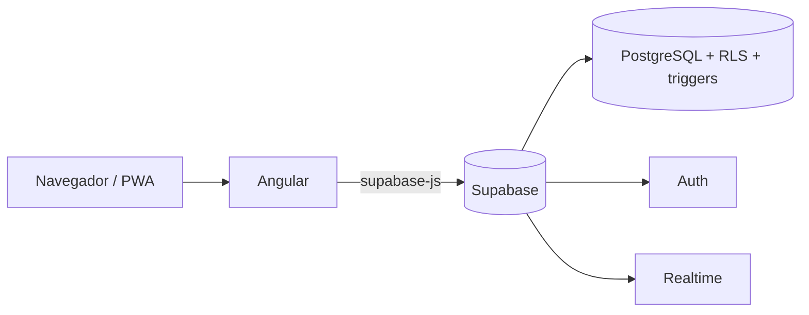

# CINEFILOS

Aplicación web para que un cine venda sus entradas online: cartelera, elección de butacas en tiempo real, compra, cupones, Candy Bar y panel de administración.

> Trabajo práctico de Programación (UTN). El seguimiento de requerimientos está en [Requerimientos.md](./Requerimientos.md).

- **URL de la aplicación:** _pendiente de despliegue_
- **Estado del proyecto:** en desarrollo. Ver el avance por requisito en [Requerimientos.md](./Requerimientos.md).

## Tecnologías

| Capa | Tecnología | Por qué |
|---|---|---|
| Front | Angular (componentes standalone) | Es el framework de la cursada |
| Estado | Signals y `computed` | Los filtros y las pantallas se recalculan solos, sin código extra de sincronización |
| Back y base | Supabase (PostgreSQL) | Base de datos, autenticación, seguridad y tiempo real en un solo servicio |
| Instalable | Angular Service Worker | Manifiesto, íconos y cache de recursos configurados; validar instalación y offline en despliegue HTTPS |

## Arquitectura



Angular es la parte que ve el usuario. Supabase funciona como backend: guarda los datos, autentica a los usuarios y hace cumplir las reglas de negocio desde la propia base.

### Estructura del código

```
src/app/
  core/        Servicios globales: cliente de Supabase, autenticación, películas, guard
  features/    Una carpeta por funcionalidad: auth, peliculas, cuenta
  shared/      Piezas reutilizables: tarjeta de película, pipes, directivas, utilidades de fechas
```

Cada funcionalidad tiene sus propios componentes y no depende de las demás. Las pantallas se cargan de forma diferida (`loadComponent`), es decir, solo se descargan cuando el usuario las visita.

## Modelo de datos

Script completo en [`cinefilos_schema_v1.sql`](./sql/cinefilos_schema_v1.sql).

| Tabla | Qué guarda |
|---|---|
| `perfiles` | Datos extra del usuario registrado, puntos, crédito y rol |
| `peliculas`, `generos`, `pelicula_generos` | Catálogo; una película puede tener varios géneros |
| `salas`, `butacas` | Salas y sus asientos, con bloque (izquierda, centro, derecha) y tipo (normal, accesible, VIP) |
| `funciones` | Proyecciones con película, sala, horario, formato e idioma |
| `compras`, `entradas` | Una compra tiene varias entradas; `usuario_id` vacío permite comprar como anónimo |
| `cupones` | Cupón de bienvenida de cada usuario |

## Decisiones técnicas

1. **Un único cliente de Supabase.** Se crea una sola vez en `SupabaseService` y se inyecta donde hace falta. Si cada servicio creara el suyo, las sesiones se pisarían.
2. **Los componentes no conocen Supabase.** Solo llaman a servicios (`Auth`, `Peliculas`). Si cambiara el proveedor, se modifican esos archivos y nada más.
3. **Las reglas de negocio viven en la base de datos.** No depender del front evita que se puedan saltear:
   - Una butaca no se vende dos veces en la misma función: índice único sobre `funcion_id` y `butaca_id`.
   - Sin funciones superpuestas y con 30 minutos de margen entre funciones de una sala: trigger `validar_funcion`.
   - Código QR único por entrada.
4. **Compra atómica.** La función `comprar_entradas` crea la compra y todas sus entradas en una sola transacción. Si una butaca ya se vendió, no se guarda nada.
5. **Seguridad con RLS.** El catálogo es público para leer y solo el administrador lo modifica. Cada usuario ve únicamente sus propios datos. La clave publicable de Supabase es pública por diseño; la clave secreta nunca se usa en el front.
6. **Perfil automático.** Un trigger crea la fila de `perfiles` cuando alguien se registra, con los datos enviados en el alta.
7. **Salas con forma fija generadas por función.** `crear_butacas` genera 20 filas A–T con 28 butacas en bloques 4/20/4; E/F son accesibles y R/S/T son VIP.
8. **Guard de rutas.** `authGuard` protege las pantallas que requieren sesión.
9. **Interfaz pensada para el cliente apurado.** La cartelera ofrece búsqueda por título/género, filtros de un toque, estados de carga, error y vacío, y acciones visibles para llegar a las funciones.
10. **Identidad visual "cine noche".** La interfaz usa azul noche y navy con tarjetas en azul petróleo, texto marfil, acento dorado y azul eléctrico. Los controles mantienen estados hover y foco visibles para navegación rápida; el logo anima un aro de carga al pasar el cursor o recibir foco, respetando la preferencia de movimiento reducido.

### Avance visual de cartelera

La pantalla de cartelera utiliza una plantilla y estilos propios. Cada película se presenta como una entrada con póster, géneros, clasificación, duración y un botón para ver funciones. Cuando falta el póster se muestra una composición tipográfica de reemplazo. La búsqueda y los filtros de género se conectan al estado reactivo de Angular; la grilla contempla carga, error, resultados y lista vacía, y adapta su distribución a pantallas pequeñas.

La tarjeta reutilizable vive en `src/app/shared/pelicula-card/`. Se comunica con la cartelera mediante `@Input` y `@Output`, e integra el pipe de duración y la directiva de resaltado. Se conserva en la carpeta de `shared/pipes/pelicula-card` una segunda tarjeta no conectada; no es la usada por esta pantalla.

El detalle de película presenta el póster, sinopsis, clasificación, géneros y duración, junto con las próximas funciones, sala, formato, idioma y precio. Los estados de carga/error y los identificadores inválidos tienen mensajes visibles; las funciones se consultan junto con la película y se evita mostrar resultados de una navegación anterior.

### Selección de butacas

Desde una función se navega a `/funcion/:id/butacas`. El mapa conserva el orden alfabético A–T: A–D quedan delante, E/F son las dos filas accesibles y G–T continúan detrás; J/K son filas normales. Todas las filas tienen 28 butacas en bloques 4/20/4; las butacas E/F se identifican en celeste y llevan icono, mientras que las VIP se muestran en rosa. El recargo VIP aparece en el total preliminar. El pasillo frontal y los dos pasillos entre bloques permanecen libres y señalizados. La migración [`20260929143500_move_accessible_rows_to_ef.sql`](./supabase/migrations/20260929143500_move_accessible_rows_to_ef.sql) conserva los IDs de butaca y transforma las filas anteriores E–K al nuevo orden. La migración [`20260929144800_update_seat_generator_for_ef.sql`](./supabase/migrations/20260929144800_update_seat_generator_for_ef.sql) fue seguida por [`20260929150100_accessible_rows_28_standard.sql`](./supabase/migrations/20260929150100_accessible_rows_28_standard.sql), que completa E/F hasta 28 butacas y actualiza el generador de salas nuevas. La interfaz permite elegir hasta ocho asientos, el mismo límite que valida el RPC existente `comprar_entradas`.

Las butacas ocupadas se consultan mediante `butacas_ocupadas`, una función de base de datos con permisos limitados que devuelve solo identificadores de asiento; la aplicación no lee las compras ni las entradas de otros clientes. Un trigger emite por Supabase Realtime únicamente el identificador de butaca y su estado de ocupación, sin publicar `compra_id`, correo ni código QR.

Antes de probar la pantalla, ejecutar una vez [`20260929120000_realtime_seat_availability.sql`](./supabase/migrations/20260929120000_realtime_seat_availability.sql) desde el SQL Editor de Supabase. La selección todavía no confirma una compra: el índice único y `comprar_entradas` siguen siendo la validación final contra carreras entre clientes.

_Se completa a medida que se implementan los módulos (tiempo real, PDF con QR, panel de administración, PWA)._
