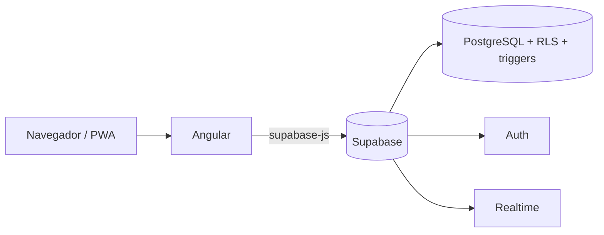

# CINEFILOS

Aplicación web para que un cine venda sus entradas online: cartelera, elección de butacas en tiempo real, compra, cupones, Candy Bar y panel de administración.

> Trabajo práctico de Programación (UTN). El seguimiento de requerimientos está en [Requerimientos.md](./Requerimientos.md).

- **URL de la aplicación:** _pendiente de despliegue_
- **Estado del proyecto:** en desarrollo. Ver el avance por requisito en [Requerimientos.md](./Requerimientos.md).

## Tecnologías

| Capa | Tecnología | Por qué |
|---|---|---|
| Front | Angular (componentes standalone) | Es el framework de la cursada |
| Estado | Signals y `computed` | Los filtros y las pantallas se recalculan solos, sin código extra de sincronización |
| Back y base | Supabase (PostgreSQL) | Base de datos, autenticación, seguridad y tiempo real en un solo servicio |
| Instalable | Angular Service Worker | Manifiesto, íconos y cache de recursos configurados; validar instalación y offline en despliegue HTTPS |

## Arquitectura



Angular es la parte que ve el usuario. Supabase funciona como backend: guarda los datos, autentica a los usuarios y hace cumplir las reglas de negocio desde la propia base.

### Estructura del código

```
src/app/
  core/        Servicios globales: cliente de Supabase, autenticación, películas, guard
  features/    Una carpeta por funcionalidad: auth, peliculas, cuenta
  shared/      Piezas reutilizables: tarjeta de película, pipes, directivas, utilidades de fechas
```

Cada funcionalidad tiene sus propios componentes y no depende de las demás. Las pantallas se cargan de forma diferida (`loadComponent`), es decir, solo se descargan cuando el usuario las visita.

## Modelo de datos

Script completo en [`cinefilos_schema_v1.sql`](./sql/cinefilos_schema_v1.sql).

| Tabla | Qué guarda |
|---|---|
| `perfiles` | Datos extra del usuario registrado, puntos, crédito y rol |
| `peliculas`, `generos`, `pelicula_generos` | Catálogo; una película puede tener varios géneros |
| `salas`, `butacas` | Salas y sus asientos, con bloque (izquierda, centro, derecha) y tipo (normal, accesible, VIP) |
| `funciones` | Proyecciones con película, sala, horario, formato e idioma |
| `compras`, `entradas` | Una compra tiene varias entradas; `usuario_id` vacío permite comprar como anónimo |
| `cupones` | Cupón de bienvenida de cada usuario |

## Decisiones técnicas

1. **Un único cliente de Supabase.** Se crea una sola vez en `SupabaseService` y se inyecta donde hace falta. Si cada servicio creara el suyo, las sesiones se pisarían.
2. **Los componentes no conocen Supabase.** Solo llaman a servicios (`Auth`, `Peliculas`). Si cambiara el proveedor, se modifican esos archivos y nada más.
3. **Las reglas de negocio viven en la base de datos.** No depender del front evita que se puedan saltear:
   - Una butaca no se vende dos veces en la misma función: índice único sobre `funcion_id` y `butaca_id`.
   - Sin funciones superpuestas y con 30 minutos de margen entre funciones de una sala: trigger `validar_funcion`.
   - Código QR único por entrada.
4. **Compra atómica.** La función `comprar_entradas` crea la compra y todas sus entradas en una sola transacción. Si una butaca ya se vendió, no se guarda nada.
5. **Seguridad con RLS.** El catálogo es público para leer y solo el administrador lo modifica. Cada usuario ve únicamente sus propios datos. La clave publicable de Supabase es pública por diseño; la clave secreta nunca se usa en el front.
6. **Perfil automático.** Un trigger crea la fila de `perfiles` cuando alguien se registra, con los datos enviados en el alta.
7. **Salas con forma fija generadas por función.** `crear_butacas` arma las 20 filas y los bloques 4/20/4 (2/10/2 en las filas accesibles J y K), y un trigger la ejecuta al crear cada sala.
8. **Guard de rutas.** `authGuard` protege las pantallas que requieren sesión.
9. **Interfaz pensada para el cliente apurado.** La cartelera ofrece búsqueda por título/género, filtros de un toque, estados de carga, error y vacío, y acciones visibles para llegar a las funciones.
10. **Identidad visual "boletería de cine".** La cartelera usa fondo oscuro, tarjetas de película estilo entrada con talón troquelado, etiquetas de género y acción visible; estilos locales en los componentes y base visual global en `styles.scss`.

### Avance visual de cartelera

La pantalla de cartelera utiliza una plantilla y estilos propios. Cada película se presenta como una entrada con póster, géneros, clasificación, duración y un botón para ver funciones. Cuando falta el póster se muestra una composición tipográfica de reemplazo. La búsqueda y los filtros de género se conectan al estado reactivo de Angular; la grilla contempla carga, error, resultados y lista vacía, y adapta su distribución a pantallas pequeñas.

La tarjeta reutilizable vive en `src/app/shared/pelicula-card/`. Se comunica con la cartelera mediante `@Input` y `@Output`, e integra el pipe de duración y la directiva de resaltado. Se conserva en la carpeta de `shared/pipes/pelicula-card` una segunda tarjeta no conectada; no es la usada por esta pantalla.

_Se completa a medida que se implementan los módulos (tiempo real, PDF con QR, panel de administración, PWA)._
